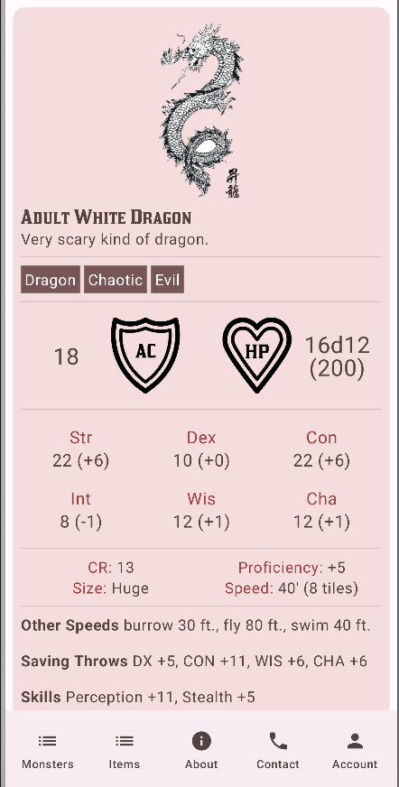

# Dungeons & Dragons Compendium

## Goal
This app catalogues the wealth of information found in the world of Dungeons & Dragons. Users can create entries for monster stats, magical item descriptions, and miscellanea of similar ilk.

## Quick-start
- Install [Android Studio](https://developer.android.com/studio).
- Clone the repository: `git clone https://github.com/MakenaH/5A6-group-project/`
- Open the repository in Android Studio.
- Run the app in Android Studio by clicking **Run > Run 'app'** or pressing **Shift+F10**.

## Screenshots of application
### About screen:  
A screen giving some information about the project and creators.  
  
   
### Contact screen:  
A screen giving some information about how the potential company could be contacted.  
  
  
### Account screens:  
The screen to sign in to an account.  
  
  
A screen allowing users to sign out and delete their account.  
  
  
### Monster screens:  
A list view of all the created monsters.  
  
  
A screen allowing the user to create a new monster.  
  
  
A screen showing the details of a monster.  
  
  
### Magic screens:  
A list view of all the created magic items.  
  
    
A screen allowing the user to create a new magic item.  
  
    
A screen showing the details of a magic item.  
  
  
  
## Team members
- Makena Howat (2139389@johnabbottcollege.net)
- Jordan Kovacs (2088248@johnabbottcollege.net)
